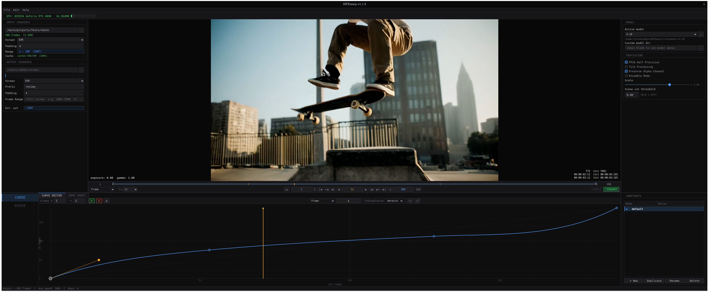

# RIFEwarp

Desktop application for VFX retiming of image sequences. Draw a timewarp curve
(output frame → source frame mapping), then render using the RIFE AI model to
synthesize sub-frame interpolations. Integer-aligned frames are copied directly;
fractional positions are AI-interpolated at a precise blend ratio.



Built on PyQt6 and PyTorch. Tested on Rocky Linux 9 with an RTX 4090.

## Features

- Interactive timewarp curve editor with five interpolation modes (Constant,
  Linear, Hermite, Bezier, Natural)
- Dope sheet timeline view of the same curve
- Scrubable image sequence viewer with frame / SMPTE timecode display
- Named snapshot variants per project — compare multiple retimes within one file
- Render queue with per-job progress, live log, and abort
- RIFE inference in a single subprocess call per job (model loads once)
- FP16, tile processing, alpha preservation, ensemble mode, optical flow scale, scene-cut detection

## Requirements

- Rocky Linux 9 / 10 (or comparable RHEL-based distro)
- Python 3.11
- NVIDIA GPU with CUDA 12.6 drivers
- `curl` and `unzip`

## Installation

```bash
git clone https://github.com/jsntsng/RIFEwarp.git
cd RIFEwarp
bash app/setup.sh
```

`setup.sh` will:
1. Check that `python3.11`, `curl`, and `unzip` are available (exit with hint if not).
2. Copy the repo tree into `~/RIFEwarp/`.
3. Create a Python 3.11 venv at `~/RIFEwarp/venv/` and install all dependencies.
4. Download the five RIFE model weight files automatically from this project's
   GitHub release assets into `~/RIFEwarp/rife/models/`. Already-present weights
   are skipped on re-runs.
5. Create `~/bin/rifewarp` symlink and a `~/.local/share/applications/rifewarp.desktop`
   entry.

If `~/bin` is not on your PATH, `setup.sh` will print the one-line `.bashrc` addition needed.

### Updating

Re-run `bash app/setup.sh` from a freshly pulled clone. Existing weights and the
venv are skipped; only changed source files are updated.

## Running

```bash
# After setup — from anywhere:
rifewarp

# Or directly from the install root:
~/RIFEwarp/launch.sh

# From a dev checkout (no install needed):
./launch.sh
```

## Models

Five RIFE 4.x versions ship as release assets and are downloaded automatically:

| Version | Notes |
|---------|-------|
| 4.9.2   | Earlier HDv3 generation; lightest weights (~20 MB) |
| 4.18    | **Recommended** — strong on live-action with complex motion (~22 MB) |
| 4.22    | **Recommended** — larger network, best on difficult motion/crossovers (~39 MB) |
| 4.25    | Newer, but can artifact on complex live-action; test before production use (~23 MB) |
| 4.26    | Newer, but can artifact on complex live-action; test before production use (~23 MB) |

Select the active model in the Settings panel. You can also point to a custom
model directory if you have a version not bundled here.

## Project files

`.rtp` files are plain JSON containing the curve (with all snapshots), I/O
settings, RIFE settings, and the render queue stamp. Open via File → Open or
drag-and-drop.

## Acknowledgments

RIFE model weights included as release assets of this repository are
© Megvii Inc., released under the MIT License, and originate from the
[Practical-RIFE](https://github.com/hzwer/Practical-RIFE) project by Zhewei Huang
et al. The model architecture files bundled in `rife/models/<version>/` are from
the same project and are also MIT-licensed.

This application is not affiliated with or endorsed by Megvii Inc.
